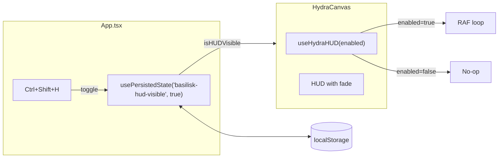

# HUD Toggle Visibility (FEAT-005)

## Overview

Enable the HUD in production builds with Ctrl+Shift+H toggle. Uses existing `usePersistedState` hook - no new hook needed.

## Architecture



## File Changes

### 1. MODIFY: `src/hooks/useHydraHUD.ts`

Add `enabled` parameter to control RAF subscription:

```typescript
const noopSubscribe = (): (() => void) => () => {};
const getEmptySnapshot = (): number => 0;

export const useHydraHUD = (enabled: boolean = true): { hudValue: number } => {
  const hudValue = useSyncExternalStore(
    enabled ? subscribe : noopSubscribe,
    enabled ? getSnapshot : getEmptySnapshot,
    getServerSnapshot
  );
  return { hudValue };
};
```

Remove the `import.meta.env.DEV` check from `subscribe()` function.

### 2. MODIFY: `src/components/HydraCanvas.tsx`

Update props and remove DEV conditional:

```typescript
type Props = {
  showStartupText: boolean;
  isHUDVisible: boolean;  // NEW
};

export const HydraCanvas = ({ showStartupText, isHUDVisible }: Props) => {
  const { hudValue } = useHydraHUD(isHUDVisible);  // Pass enabled flag
  // ...
  
  // Replace {import.meta.env.DEV && (...)} with:
  <div
    className={`${hudClass} transition-opacity duration-150 ${
      isHUDVisible ? 'opacity-100' : 'opacity-0 pointer-events-none'
    }`}
    style={hudStyle}
  >
    {/* HUD content */}
  </div>
```

### 3. MODIFY: `src/App.tsx`

Use existing `usePersistedState` for HUD visibility:

```typescript
// Add to imports
import { usePersistedState } from './hooks/usePersistedState';

// In component
const [hudVisible, setHudVisible] = usePersistedState<boolean>('basilisk-hud-visible', true);

// Add shortcut (after existing Ctrl+H)
{
  key: 'h',
  ctrl: true,
  shift: true,
  action: () => setHudVisible(prev => !prev),
  allowInEditor: true,
},

// Update HydraCanvas
<HydraCanvas showStartupText={!hasExecutedCode} isHUDVisible={hudVisible} />
```

Update useMemo dependencies to include `setHudVisible`.

## Keyboard Shortcuts

| Shortcut | Action |

|----------|--------|

| Ctrl+H | Toggle REPL (existing) |

| Ctrl+Shift+H | Toggle HUD (new) |

## Validation Gates

| Todo | Validation Command | Pass Criteria |

|------|-------------------|---------------|

| update-hydrahud | `npm test -- useHydraHUD` | 0 failures |

| update-canvas | `npm run typecheck && npm test -- HydraCanvas` | 0 errors |

| add-shortcut | `npm run typecheck && npm run lint` | 0 errors |

| integration-test | Playwright MCP verification steps | All pass |

| verify | `npm run typecheck && npm run lint && npm test && npm run build` | All pass |

## Playwright MCP Verification Steps

1. `browser_navigate` to `http://localhost:5173`
2. `browser_evaluate` to clear `localStorage` once and confirm HUD visible:

   - `document.querySelector('[data-testid="hydra-hud"]')?.className.includes('opacity-100')`

3. `browser_press_key` `Control+Shift+H` to hide HUD
4. `browser_evaluate` HUD class contains `opacity-0`
5. `browser_navigate` (reload) and `browser_evaluate` HUD still `opacity-0`
6. `browser_press_key` `Control+Shift+H` to show HUD
7. `browser_evaluate` HUD class contains `opacity-100`
8. `browser_navigate` (reload) and `browser_evaluate` HUD still `opacity-100`